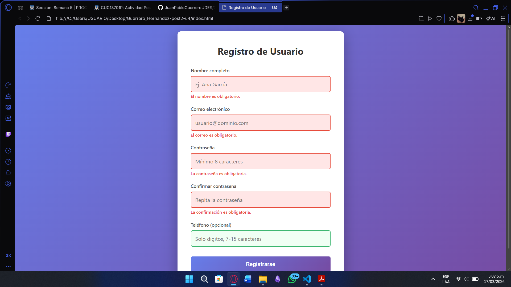
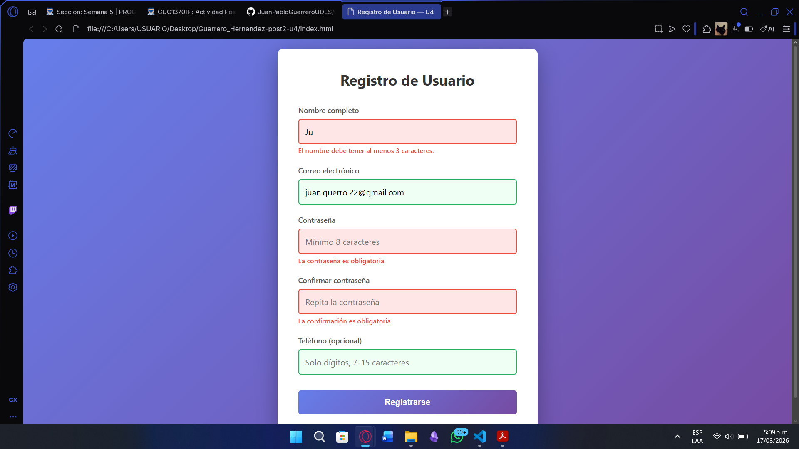
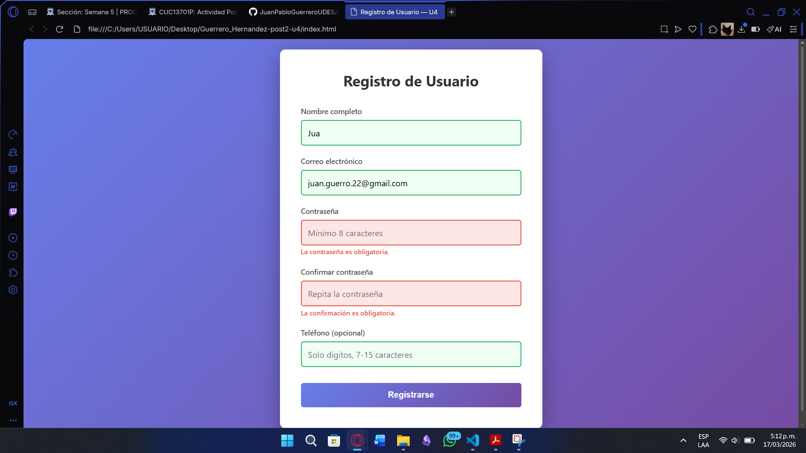
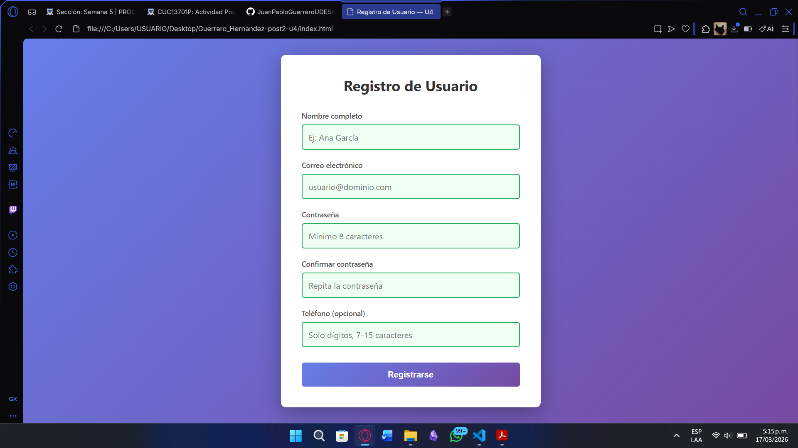
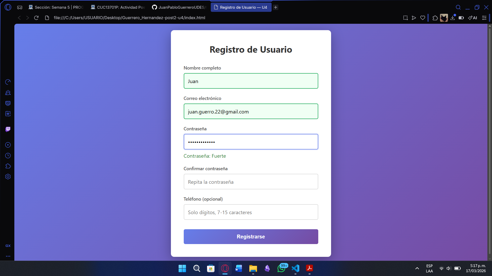

# Registro de Usuario — U4

## Descripción del proyecto
Este proyecto es un formulario de registro de usuario desarrollado con HTML, CSS y JavaScript. Permite a los usuarios ingresar su nombre completo, correo electrónico, contraseña, confirmación de contraseña y teléfono opcional. Incluye validación en tiempo real para asegurar que los datos sean correctos antes del envío.

## Instrucciones de ejecución
Para ejecutar el proyecto, simplemente abre el archivo `index.html` en tu navegador web preferido. No se requiere instalación adicional ni servidor local.

## Tecnologías utilizadas
- HTML5: Para la estructura del formulario y la página web.
- CSS3: Para el estilo y diseño visual del formulario.
- JavaScript: Para la validación de los campos del formulario y manejo de eventos.

## Capturas de pantalla

